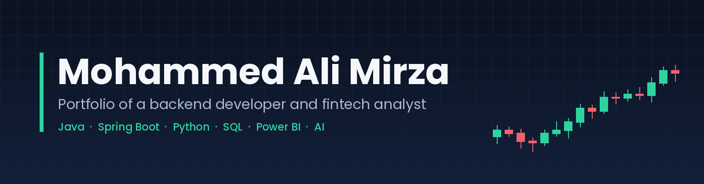
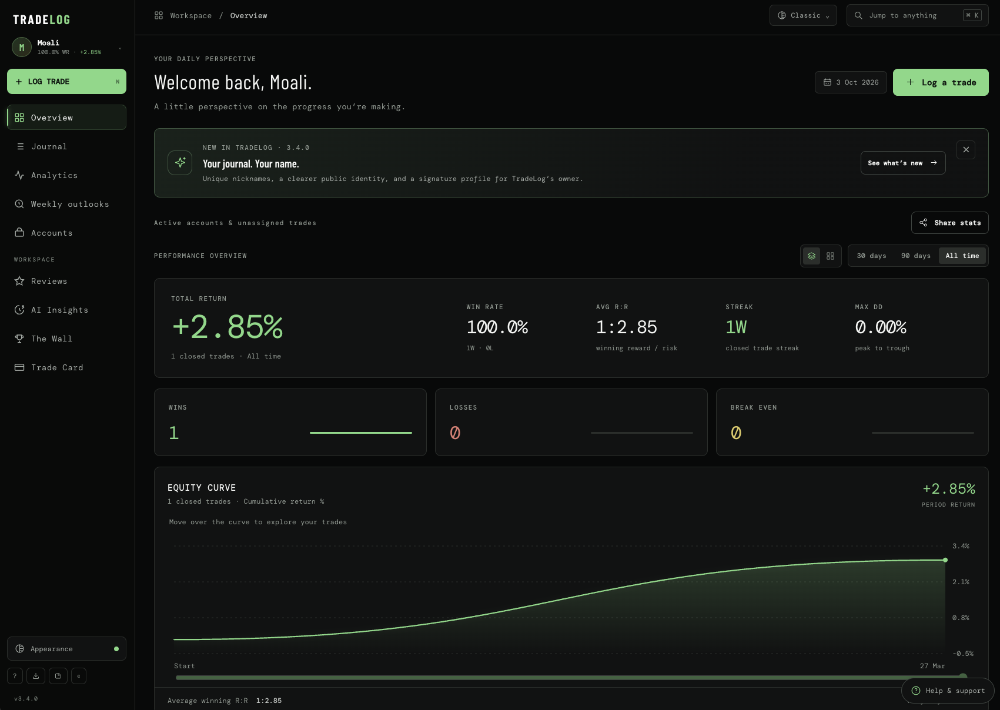
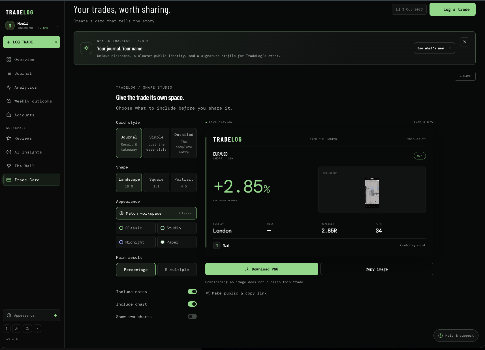
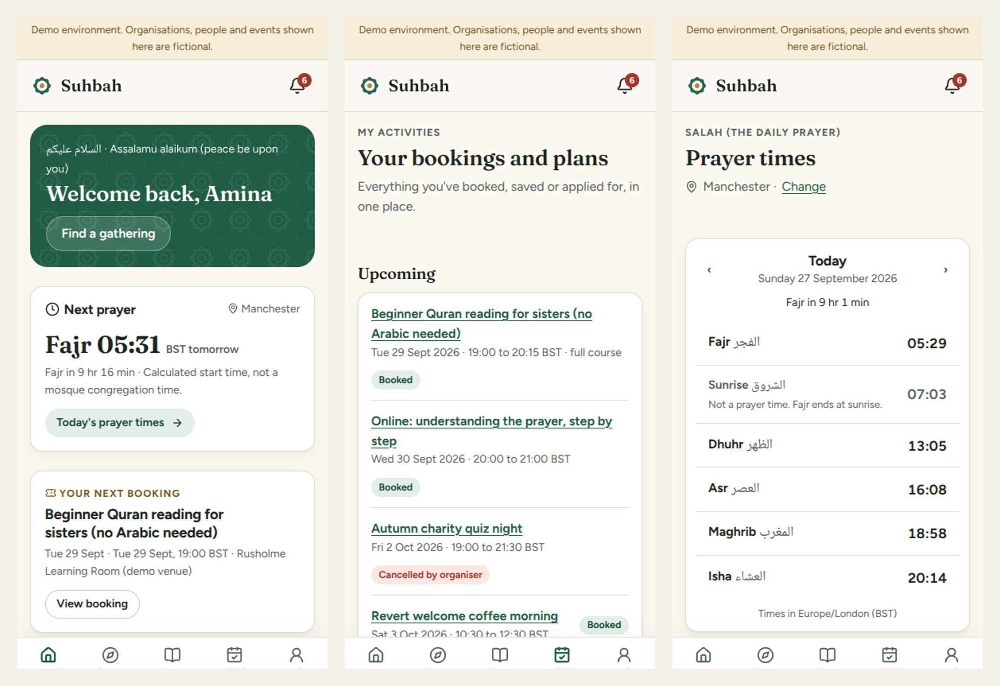
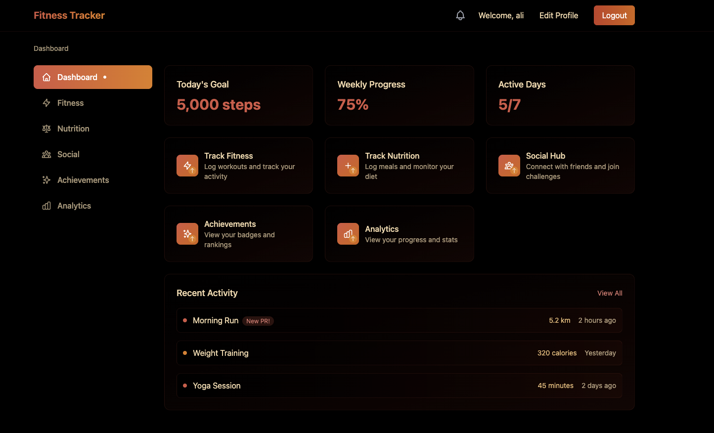

### 
I'm Ali, a Backend Developer and FinTech graduate 👨‍💻 Based in Manchester 🇬🇧

- 🔭 I'm currently a KYC Analyst in Business Banking at Barclays
- 💼 Two years as a Backend Developer at Peachr, building Spring Boot services for e-commerce and UK healthcare clients
- 📖 MSc Financial Technology at the University of Salford (submitted, results pending) and BSc (Hons) Computer Science, 2:1
- 🌱 I build with AI every day: RAG and agent systems, workflow automation and the OpenAI and Anthropic APIs
- ⚡ I am passionate about finance, trading, property and building products people actually use
- 🎯 Open to roles across software, data and analysis
- 📫 Feel free to contact me on [LinkedIn](https://www.linkedin.com/in/ali-mirza02/)

 

# Education

| Degree | University | Dates | Result |
| --- | --- | --- | --- |
| MSc Financial Technology | University of Salford | 09/2025 to 09/2026 | Submitted, results pending |
| BSc (Hons) Computer Science | University of Salford | 09/2022 to 06/2025 | 2:1 |

# Skills
To get the name of the skill, place your cursor on it.
<table><tr align="center"><td valign="top" width="33%">

### Backend

 

</td><td valign="top" width="33%">

### Data & AI

 

</td><td valign="top" width="33%">

### Web & DevOps

 

</td></tr></table>

# Projects

To improve the readability of my projects, here is a legend of the emojis in the title of the projects:
- :lock: : private project, for a company for example, so I can not show the code
- :hammer_and_wrench: : software project
- :bar_chart: : data and finance project
- :robot: : AI project
- :books: : educational project
- :man: : personal project

- [Projects](#projects)
  - [:hammer_and_wrench: :man: TradeLog, a free trading journal](#hammer_and_wrench-man-tradelog-a-free-trading-journal)
  - [:hammer_and_wrench: :man: Suhbah, a community app for Muslim reverts](#hammer_and_wrench-man-suhbah-a-community-app-for-muslim-reverts)
  - [:robot: :man: Jarvis, a voice enabled AI assistant](#robot-man-jarvis-a-voice-enabled-ai-assistant)
  - [:hammer_and_wrench: :lock: Backend services for e-commerce and healthcare clients](#hammer_and_wrench-lock-backend-services-for-e-commerce-and-healthcare-clients)
  - [:bar_chart: :books: Credit risk prediction with Machine Learning](#bar_chart-books-credit-risk-prediction-with-machine-learning)
  - [:bar_chart: :books: Buy Now Pay Later and consumer financial vulnerability in the UK](#bar_chart-books-buy-now-pay-later-and-consumer-financial-vulnerability-in-the-uk)
  - [:bar_chart: :books: Portfolio analysis with clustering and Monte Carlo simulation](#bar_chart-books-portfolio-analysis-with-clustering-and-monte-carlo-simulation)
  - [:hammer_and_wrench: :books: Fitness tracking web app](#hammer_and_wrench-books-fitness-tracking-web-app)

## [:hammer_and_wrench: :man: TradeLog, a free trading journal](https://www.trade-log.co.uk/)

I trade the markets myself and found that most trading journals were expensive and limited in what they could do. So I built my own and made it free.

TradeLog lets traders log their trades and review their market bias. It has an analytics dashboard and AI insights that help traders see what is working and what is not.

  

It is built with React and Firebase and deployed on Vercel. More than 100 traders have signed up with no marketing at all. I only shared it in the trading groups I am part of.

Traders can also turn any trade into a card to share with others.

  

## :hammer_and_wrench: :man: Suhbah, a community app for Muslim reverts

Suhbah means companionship. People who are new to Islam can feel isolated even inside their own community. Suhbah helps reverts and Muslims reconnecting with their faith find welcoming local gatherings, book a place and take a manageable next step.

  

It is a mobile-first progressive web app that installs to the phone Home Screen. Manchester is the demonstration location.

What it does:
- members discover gatherings and volunteering, book a place, join a waitlist and add bookings to their calendar
- mosques, charities and teachers create and manage events and see who is attending
- an admin team reviews organisers and moderates reports
- daily prayer times, a Quran reader and push notifications for reminders

It is built with Next.js, React and TypeScript on a PostgreSQL database with Drizzle ORM. It is deployed on Vercel with Supabase and covered by 57 integration tests, 19 browser journey checks and automated accessibility scans.

This project is still in development so the code is private for now.

## :robot: :man: Jarvis, a voice enabled AI assistant

Jarvis is a personal assistant I can talk to. It does more than answer questions. It completes tasks from start to finish by calling tools and pulling information from the web.

This project is where I put my daily AI work into practice: calling the OpenAI and Anthropic APIs in code, building agent systems and automating workflows.

## :hammer_and_wrench: :lock: Backend services for e-commerce and healthcare clients

For two years I worked as a Backend Developer at Peachr, a backend development agency. I built Spring Boot microservices for clients in e-commerce and UK healthcare.

The stack was Java, Spring Boot, PostgreSQL, Docker and AWS with CI/CD pipelines, tested with JUnit and Mockito. I also built data pipelines with Python scripts, SQL stored procedures and Java services, and created Power BI visualisations to show analytics to stakeholders.

This was client work so I can not show the code.

## :bar_chart: :books: Credit risk prediction with Machine Learning

For my MSc I ran a comparative study of four models for predicting credit risk:
- Logistic Regression
- Random Forest
- XGBoost
- an LSTM tuned with a genetic algorithm

The study focuses on the trade-off between accuracy and explainability. A more accurate model is not always the better choice for a lender if nobody can explain its decisions. I linked the results to the regulation that applies: GDPR Article 22, the EU AI Act and the FCA Consumer Duty.

## :bar_chart: :books: Buy Now Pay Later and consumer financial vulnerability in the UK

This is my MSc dissertation. It was awarded 73.9 out of 100, a distinction-level mark.

It asks how the growth of Buy Now Pay Later relates to financial difficulty among UK consumers, especially people who use it often.

It is a quantitative secondary analysis of the FCA Financial Lives Survey using the 2022 and 2024 waves. It covers four areas: market growth, how and how often people use BNPL, who is most vulnerable and what this means for consumer protection.

## :bar_chart: :books: Portfolio analysis with clustering and Monte Carlo simulation

A group project for my FinTech Data Analytics module. We used K-Means clustering to group assets and then built portfolios from the clusters.

My part was in two sections:
- estimating the return and risk of equal-weight portfolios across clusters using Modern Portfolio Theory, with the covariance matrix and portfolio variance
- running a Monte Carlo simulation to optimise the portfolio, with Sharpe ratio analysis, the Efficient Frontier and the Capital Market Line

## :hammer_and_wrench: :books: Fitness tracking web app

My BSc dissertation project. It is a fitness tracking web app built on the MERN stack (MongoDB, Express, React and Node.js).

  

Users can log workouts and meals, set nutrition goals and follow their progress on an analytics dashboard.

To keep people coming back I added gamification and a social side:
- points, badges, levels and streaks with a leaderboard
- friends, an activity feed and challenges
- a workout partner system with shared goals and chat

The front end is React with Vite and Tailwind. The back end is an Express API with JWT login and MongoDB for storage.

# Connect with me

 
